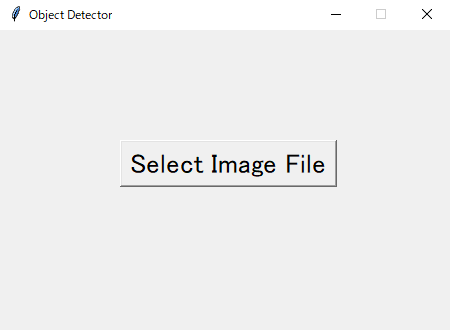

# ObjectDetector

物体検出を行う機械学習モデルである[YOLOv3](https://github.com/YunYang1994/TensorFlow2.0-Examples/tree/master/4-Object_Detection/YOLOV3)をGUIで使えるようにしたプログラムです。

## 実行方法

### 必要なモジュールのインストール

`pip install -r requirements.txt`

### 実行

`python yolov3.py`

## 使い方

プログラムを実行すると以下のウィンドウが表示されるので、Select Image Fileをクリックします。

画像を選択すると、その画像に対する物体検出の結果が表示されます。

## サンプル画像

サンプルの画像を[sample/source](sample/source)、それらの画像に対する物体検出の結果を[sample/result](sample/result)に配置しています。

サンプル画像は[COCO dataset](https://cocodataset.org/#download)の2017 Test images [41K/6GB]を使用しています。